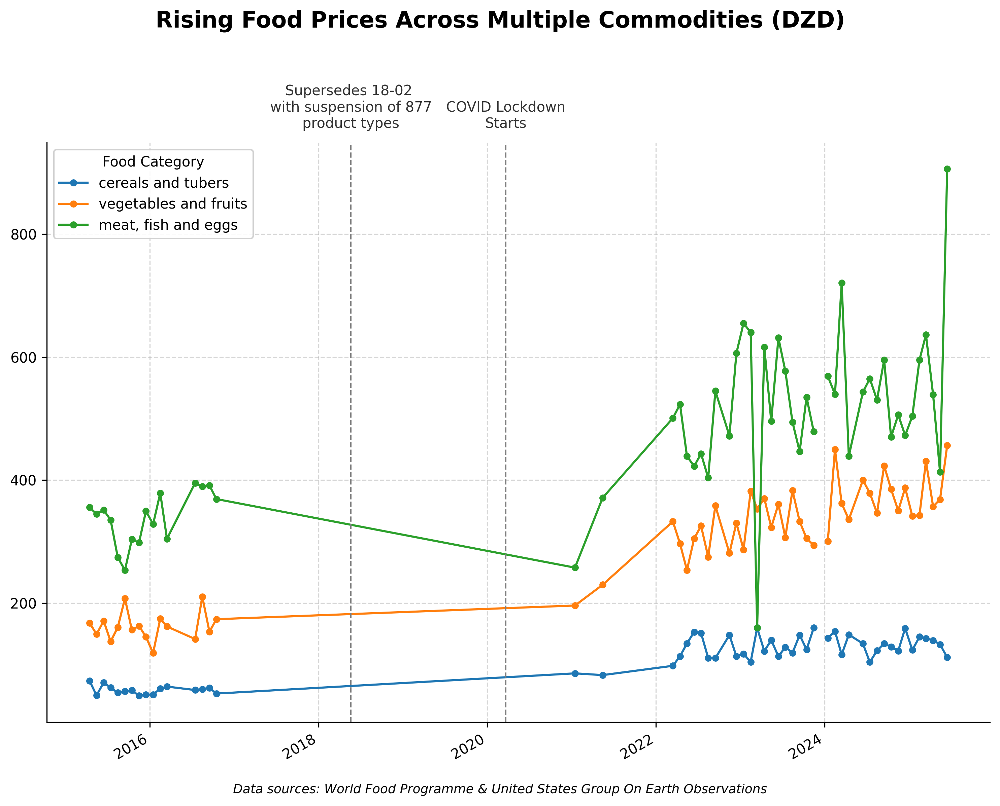
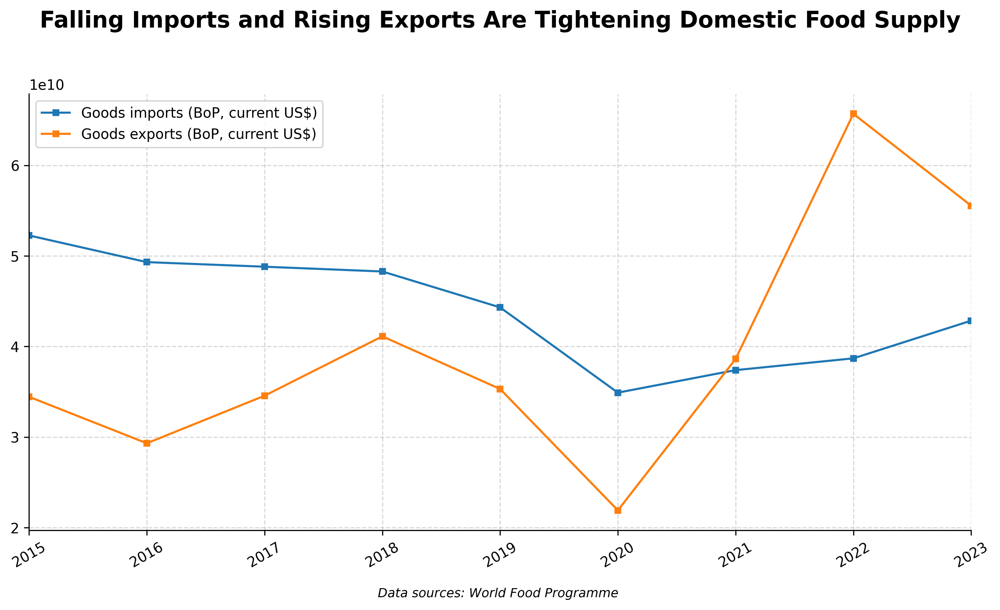
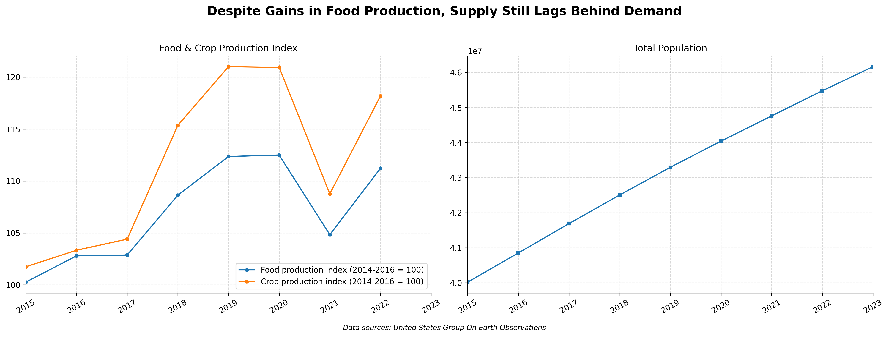
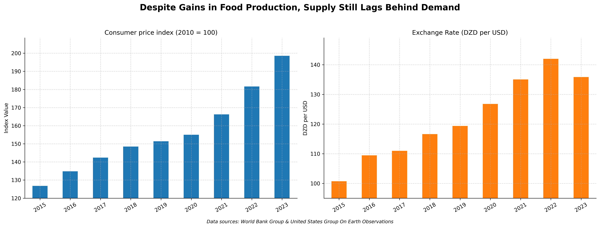

# Forecasting Food Prices in Algeria: A Macro-Micro Analytical Approach

## Project Background

Algeria, a North African country heavily reliant on food imports, has experienced a concerning rise in staple food prices in recent years. As a data analyst targeting public-sector economic research, I was curious in identifying **macro-level and micro-level contributors** to this inflation, with a focus on the following business-critical questions:

- Are Algeria’s increasing exports and decreasing imports tightening domestic food supply?
- Is domestic food production keeping up with demand and cost pressures?
- How is the Algerian Dinar's depreciation impacting food affordability?

By combining local commodity-level price data (e.g., rice, pasta, eggs) with national indicators like food production index, exchange rates, and import/export values, we can build a multi-layered picture of Algeria’s food economy.

---

Insights and recommendations are provided across key areas:

- **Trade Dynamics and Food Supply**  
- **Agricultural Production and Food Security**  
- **Currency Depreciation and Import Costs**  

---

>  The notebook used to clean the food supply data can be found [here](notebooks/Cleaning_Food.ipynb)  
>  The notebook used to clean the indicators data can be found [here](notebooks/Cleaning_Indicators.ipynb)  
>  The Dashboards can be found [here](notebooks/EDA.ipynb)  

---

# Data Structure & Initial Checks

This project is based on two key datasets:

- **Local Market Pricing Dataset (`food.csv`)**  
  Contains monthly prices for commodities (e.g., rice, pasta, eggs) across two Algerian markets from 2015–2025. [_Source_](https://data.humdata.org/dataset/6ca04cee-665a-4037-b04e-b94a8b2cdef9)

  
| Feature       | Description                                                                  |
| ------------- | ---------------------------------------------------------------------------- |
| **province**  | The top-level administrative region within Algeria where data was collected. |
| **town**      | The municipality or town within the province.                                |
| **market**    | Name of the specific marketplace or bazaar.                                  |
| **latitude**  | Geographic latitude of the market location (in decimal degrees).             |
| **longitude** | Geographic longitude of the market location (in decimal degrees).            |
| **category**  | Broad classification of the food item (e.g., grains, fruits, meats).         |
| **commodity** | Specific food product name within its category.                              |
| **price**     | Local price of the commodity (in Algerian Dinars).                           |
| **usdprice**  | Equivalent price converted to U.S. dollars (for international comparison).   |
| **unit**      | Unit of measurement for the price and quantity (e.g., kg, liter).            |
| **quantity**  | Quantity of the commodity available or sold (in the given unit).             |
- **Macroeconomic Indicators Dataset (`indicators.csv`)**  
  Contains annual indicators such as food production index, agricultural land use, exchange rates, and import/export values from 2014–2023.

Combined, these datasets provide a **time-series structure** where the monthly commodity prices are aligned with corresponding annual macroeconomic indicators. [_Source_](https://data.amerigeoss.org/en/dataset/world-bank-indicators-for-algeria)

| Feature                                                               | Description                                                                                                                        |
| --------------------------------------------------------------------- | ---------------------------------------------------------------------------------------------------------------------------------- |
| **Population, total**                                                 | Total number of people residing in the country or region.                                                                          |
| **Food production index (2014-2016 = 100)**                           | Relative measure of food production, where the average production level in 2014–2016 is set to 100.                                |
| **Goods imports (BoP, current US\$)**                                 | Total value of goods imported, measured in current U.S. dollars, from the balance of payments.                                     |
| **Goods exports (BoP, current US\$)**                                 | Total value of goods exported, measured in current U.S. dollars, from the balance of payments.                                     |
| **Consumer price index (2010 = 100)**                                 | Measure of the average change over time in the prices paid by consumers for a market basket of goods and services, base year 2010. |
| **Crop production index (2014-2016 = 100)**                           | Relative measure of crop output, with the 2014–2016 average set as the 100 baseline.                                               |
| **Cereal production (metric tons)**                                   | Total quantity of cereals (e.g., wheat, rice, maize) produced, measured in metric tons.                                            |
| **Inflation, GDP deflator (annual %)**                                | Annual percentage change in the GDP deflator, reflecting inflation across the economy.                                             |
| **Inflation, GDP deflator: linked series (annual %)**                 | Annual percentage change in the GDP deflator adjusted as a continuous series across changing base years.                           |
| **Inflation, consumer prices (annual %)**                             | Year-over-year percentage change in the consumer price index, i.e., consumer inflation rate.                                       |
| **Official exchange rate (LCU per US\$, period average)**             | Average number of local currency units (LCU) required to purchase one U.S. dollar over the reporting period.                       |
| **Agriculture, forestry, and fishing, value added (% of GDP)**        | Share of GDP accounted for by agriculture, forestry, and fishing activities.                                                       |
| **Agriculture, forestry, and fishing, value added (annual % growth)** | Year-over-year percentage growth in the value added by agriculture, forestry, and fishing sectors.                                 |
| **Agriculture, forestry, and fishing, value added (current US\$)**    | Monetary value added by agriculture, forestry, and fishing, expressed in current U.S. dollars.                                     |

---

# Executive Summary

### Overview of Findings

1. **Trade shifts are tightening local food supply.** With **exports rising** and **imports declining**, domestic availability of key staples is shrinking—contributing to price inflation.
2. **Production is improving—but not fast enough.** Algeria’s food production index shows modest growth, but not enough to offset currency pressure and reduced imports.
3. **Currency depreciation is amplifying import costs.** The **Algerian Dinar's fall against the US Dollar** has made food imports significantly more expensive.

---

# Insights Deep Dive

### Trade Dynamics and Food Supply

* Imports of goods and services declined 26% between 2016 and 2022, while exports rose by 47%.
* The gap between import volumes and local availability coincided with a **100–130% increase in local staple prices**.
* Export incentives may be unintentionally diverting supply away from domestic markets.

---

### Agricultural Production and Food Security

* The food production index increased from 100 in 2015 to 111 in 2022—a modest improvement.
* However, this increase lags behind **demand growth**, especially in urban centers.
* Agricultural land use remains static at ~17% of land area, indicating no significant scale-up in farming capacity.
* Algeria’s food production growth does not align with its reduction in imports, creating a **supply shortfall**.

---

### Currency Depreciation and Import Costs

* The Algerian Dinar depreciated 29% against the USD from 2015 to 2022.
* USD-denominated import costs rose sharply, especially for cereals, rice, and vegetables.
* Local market prices track closely with USD price movements, especially for imported goods.
* Currency-driven cost increases are passed directly to consumers due to lack of subsidy buffers.

# Recommendations:

Based on the insights and findings above, we would recommend the **Ministry of Agriculture and Trade Policy Teams** to consider the following:

* **Re-evaluate export incentives** for agricultural commodities.  
  → **Ensure local food security is prioritized before international trade objectives.**

* **Increase investment in local agricultural capacity.**  
  → **Expand agricultural land and improve productivity per worker.**

* **Implement price buffers or food reserves** for high-risk imported goods.  
  → **Reduce dependency on volatile exchange rate swings.**

* **Improve import policy agility.**  
  → **Enable faster trade responses to local shortages (e.g., fast-track cereal imports).**

* **Introduce early warning systems** using price and macroeconomic forecasting.  
  → **Allow policy teams to act before price spikes hit consumers.**

